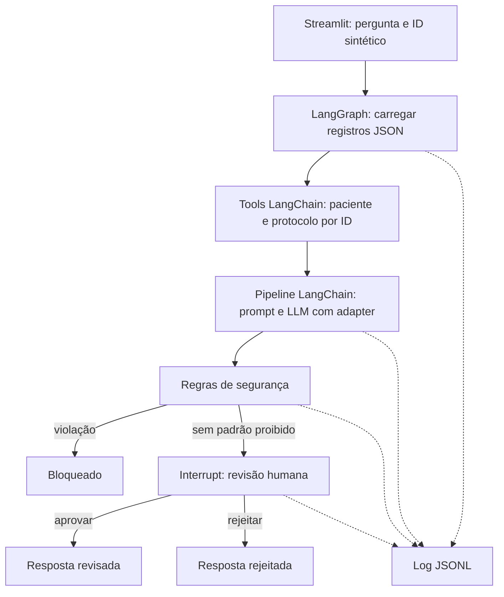

# Assistente hospitalar acadêmico — Tech Challenge Fase 3

Projeto Python mínimo para o desafio 8IADT: MedQuAD + exemplos hospitalares sintéticos → LoRA/QLoRA no Colab → assistente LangChain/LangGraph → revisão humana → auditoria JSONL.

**Somente demonstração acadêmica. Não usar para assistência real.** Os pacientes, protocolos e documentos internos são fictícios. As regras não constituem protocolos clínicos validados. O modo demonstração não executa LLM e não comprova fine-tuning.

## Execução rápida (sem GPU)

Python 3.11 ou 3.12. Na raiz do repositório:

```sh
python -m venv .venv
# Windows: .venv\Scripts\activate
# Linux/macOS: source .venv/bin/activate
python -m pip install -r requirements.txt
python -m pytest -q
python -m streamlit run app.py
```

Selecione P001 e analise as pendências. A resposta fica em `pending_review` até registrar uma decisão com identificador de revisor. P003 demonstra um alerta fictício. Rejeitar encerra sem liberar a resposta. Saídas com padrões proibidos ficam bloqueadas sem botão de aprovação. Nenhuma ferramenta emite receita ou modifica prontuário.

## Fine-tuning real no Colab

Abra [o notebook no Google Colab](https://colab.research.google.com/github/felipepereira598-cmd/techChallenge3/blob/main/notebooks/training_colab.ipynb), ative GPU T4 e execute em ordem. O notebook clona este repositório, instala dependências, baixa as fontes e prepara cerca de 3.000 exemplos. Repositório privado requer token de leitura informado em campo oculto; não o salve em código.

1. MedQuAD: XML → limpeza de espaços, remoção de respostas ausentes/longas, exclusão das coleções 10/11/12 e deduplicação das perguntas.
2. Separação determinística por documento-fonte, aproximadamente 80/10/10; distribuição exata fica no manifesto.
3. Curadoria humana da amostra, preservação de URL e tipo da pergunta; anonimização básica por padrões. **Nomes e outros identificadores em texto livre exigem revisão manual. Não alimentar dados reais.**
4. Treino combina MedQuAD com `data/synthetic/training.jsonl`, incluindo protocolo, FAQ, laudo, receita vazia e registro de procedimento. Esses exemplos são mínimos para demonstrar cobertura, não um corpus hospitalar representativo.
5. Qwen2.5-1.5B-Instruct com QLoRA NF4, rank 8, q/v projections, 1 época, batch 1, acumulação 8, sequência 1.024. A perda é calculada somente na resposta do assistente. Exemplos maiores são descartados e contados, sem cortar respostas silenciosamente.
6. Salvar adapter e manifestos. A revisão do modelo é resolvida e fixada no início do notebook. Os commits dos dados e hashes dos arquivos de entrada ficam registrados.
7. Comparar modelo base e fine-tuned nas mesmas perguntas de teste, com a mesma revisão e geração determinística. PubMedQA PQA-L é usado só para avaliação complementar, nunca no treino.
8. Baixar `training-artifacts.zip`, extrair `models/adapter` na raiz local e reiniciar o aplicativo.

O tempo e a memória dependem da GPU e do comprimento dos exemplos. Para diagnóstico rápido, acrescente `--max-steps 2` ao comando de treino; isso é teste de execução, não experimento final. Se faltar memória, reduza `--max-length` para 512 e registre o aumento dos descartes. Uma reinicialização do Colab pode ser necessária após a instalação.

## Usar o adapter na interface

```sh
python -m pip install -r requirements-training.txt
python -m streamlit run app.py
```

Selecione **Fine-tuned local**. O adapter padrão é `models/adapter`; a variável `ADAPTER_PATH` permite outro diretório. Inferência local usa CPU quando não há CUDA, com possível lentidão. O aplicativo falha explicitamente se o adapter estiver ausente. Não substitui um adapter faltante pelo modelo base. O modo local lê automaticamente o modelo e a revisão do manifesto salvo com o adapter. A avaliação usa esse mesmo manifesto para manter a comparação consistente.

## Comandos independentes

```sh
python -m scripts.prepare_medquad --raw data/raw/MedQuAD --limit 3000
python -m scripts.prepare_pubmedqa --input data/raw/pubmedqa/data/ori_pqal.json
python -m scripts.train --qlora --revision COMMIT_DO_MODELO
python -m scripts.evaluate --quantized --revision COMMIT_DO_MODELO --limit 50
```

`--qlora` requer GPU CUDA, Linux e bitsandbytes. Sem essa opção o treino usa LoRA, sem quantização. O notebook usa subprocessos com verificação de erro para treino e avaliação.

## Fluxo e fontes



Consultas estruturadas usam IDs exatos em JSON; não há RAG, embeddings, banco vetorial, API de serviço ou orquestração distribuída. O estado é atualizado a cada nova solicitação. A revisão considera o snapshot apresentado; se os registros mudarem, inicie nova análise.

A interface exibe observações, exames pendentes, alertas e fontes com caminho, ID e versão/data. Isso oferece rastreabilidade do contexto fornecido, **não uma prova automática de suporte a cada frase nem acesso ao raciocínio interno da LLM**. URLs lembradas pelo modelo não são tratadas como evidência validada. O revisor deve verificar fidelidade às fontes apresentadas.

## Auditoria e segurança

`logs/audit.jsonl` registra timestamp UTC, ID da solicitação, etapas, dados sintéticos consultados, pergunta redigida, fontes, rascunho, modelo, versão do prompt, duração, violações, decisão e observação do revisor. Falhas registram tipo de erro, sem despejar exceções que possam conter dados. O log é local, não tem criptografia ou proteção contra alteração e não deve receber dados reais. Não o publique automaticamente.

O checkpointer em memória mantém a pausa durante a sessão. Reiniciar o servidor perde revisões pendentes; o log permanece. A identificação do revisor é autodeclarada, adequada somente à demonstração local. Não há autenticação profissional. Regex tem falsos positivos e negativos; nenhuma aprovação é automática. Conteúdo do paciente é tratado como dado no prompt, mas isso não elimina prompt injection. Toda resposta liberada exige revisão humana.

## Avaliação e entregáveis

`results/base.jsonl` e `results/fine_tuned.jsonl` preservam respostas individuais. `results/comparison.json` contém token F1 MedQuAD, taxa de padrões de risco, acurácia PubMedQA e respostas fora do formato. Token F1 mede sobreposição lexical, não correção médica. PubMedQA mede resposta ao resumo científico, não conduta clínica. O conjunto PQA-L completo/amostra é uma avaliação local, não o protocolo oficial de benchmark. Faça revisão cega adicional usando `data/evaluation/human_rubric.json`.

**Não há resultado de treinamento pré-calculado nem ganho de qualidade declarado.** Execute o notebook e incorpore os resultados reais ao [relatório técnico](docs/relatorio_tecnico.md). O [roteiro de vídeo](docs/roteiro_video.md) cobre a apresentação de até 15 minutos. O código implementa o pipeline; a entrega acadêmica só estará completa após treinamento, análise de resultados e gravação.

## Estrutura

- `src/`: LLM, tools, graph, safety e logger.
- `scripts/`: preparação MedQuAD/PubMedQA, treino e avaliação.
- `notebooks/`: execução Colab.
- `data/synthetic/`: registros hospitalares e exemplos de treino fictícios.
- `data/evaluation/`: rubrica humana independente.
- `tests/`: revisão, bloqueio, isolamento, logging, curadoria e máscara de perda.
- `docs/`: relatório, matriz de requisitos e roteiro de demonstração.

## Fontes e licenças

- [MedQuAD](https://github.com/abachaa/MedQuAD): Ben Abacha e Demner-Fushman (2019), *A Question-Entailment Approach to Question Answering*. Dataset CC BY 4.0 conforme repositório. Coleções com respostas removidas não são recuperadas por crawler. Preservar atribuição ao distribuir derivados.
- [PubMedQA](https://github.com/pubmedqa/pubmedqa): Jin et al. (2019), *PubMedQA: A Dataset for Biomedical Research Question Answering*. Consultar termos do dataset e fontes antes de redistribuir os resumos; baixados no Colab e não incorporados aqui.
- [Qwen2.5-1.5B-Instruct](https://huggingface.co/Qwen/Qwen2.5-1.5B-Instruct): consultar model card e licença do modelo antes de distribuir adapters.
- [PEFT quantization](https://huggingface.co/docs/peft/developer_guides/quantization) e [LangGraph interrupts](https://docs.langchain.com/oss/python/langgraph/interrupts).

Os dados processados são reconstruídos pelo pipeline e ficam fora do Git por padrão. Os exemplos sintéticos autorais ficam versionados. Isso satisfaz o entregável de exemplo de dataset sem duplicar datasets de terceiros.

## Compatibilidade com o Colab

O notebook instala as dependencias em `.venv-colab`, sem misturar as versoes do projeto com torchvision, diffusers, gradio e LangChain preinstalados no Colab. Todos os comandos de treino e avaliacao usam esse Python isolado. A saida completa aparece na celula e e gravada em `logs/colab-training.log` ou `logs/colab-evaluation.log`. O aviso de HF_TOKEN ausente nao impede o acesso ao modelo publico.

Para atualizar uma sessao existente, execute a primeira celula (git pull --ff-only) e a instalacao novamente. Alteracoes locais conflitantes nao sao descartadas automaticamente.
